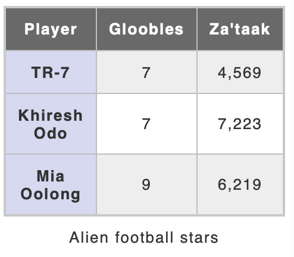

```{r setup, include=FALSE}
library(xfun)
pkg_attach2("tidyverse", "jsonlite", "janitor", "DiagrammeR")
knitr::opts_chunk$set(fig.align = 'center')
```

# 📝 Lesson Preview

- Parse JSON (nested data formats)

- HTTP verbs (GET, POST, HEAD, PUT) and *httr*

- Parse HTML tables

- String manipulation

---

class: inverse, center, middle
background-color: #FFC400

# JSON: A common nested data format on the web

---

# JSON

JSON -- JavaScript Object Notation

JavaScript is a widely used programming language for the web. JSON follows a similar syntax.

JSON is intended to be more human readable than another common internet data format [XML](https://en.wikipedia.org/wiki/XML).

---

# 🔑 JSON syntax

Simple objects are key-value pairs separated by a colon (`:`) and enclosed in curly brackets (`{}`). 

For example:

```json
{"firstName": "John"}
```

<br>
<br>
<br>

(following example data from [Wikipedia](https://en.wikipedia.org/wiki/JSON#Example))

---

# 🔑 JSON syntax

Curly brackets can enclose multiple key-value pairs, separated by commas (`,`):

```json
{
  "firstName": "John",
  "lastName": "Smith"
}
```

---

# JSON syntax

Objects can be **nested** inside of each other:

```json
{
  "firstName": "John",
  "lastName": "Smith",
  "isAlive": true,
  "age": 27,
  "address": {
    "streetAddress": "21 2nd Street",
    "city": "New York",
    "state": "NY",
    "postalCode": "10021-3100"
  }
```

There are multiple key-value pairs nested in `address`. 

```
firstName
lastName
isAlive
age
address
|____ streetAddress
|____ city
|____ state
|____ postalCode
```

---

# JSON syntax

**Indentation** and line breaks are not required, but helps us see the nesting structure.

```json
{
  "firstName": "John",
  "lastName": "Smith",
  "isAlive": true,
  "age": 27,
  "address": {
    "streetAddress": "21 2nd Street",
    "city": "New York",
    "state": "NY",
    "postalCode": "10021-3100"
  }
```

---

# JSON syntax

Square brackets (`[]`) enclose **arrays**. Arrays are **ordered** sequence of key-value pairs.

```json
{
  "firstName": "John",
  "lastName": "Smith",
  "isAlive": true,
  "age": 27,
  "address": {
    "streetAddress": "21 2nd Street",
    "city": "New York",
    "state": "NY",
    "postalCode": "10021-3100"
  },
  "phoneNumbers": [
    {
      "type": "home",
      "number": "212 555-1234"
    },
    {
      "type": "office",
      "number": "646 555-4567"
    }
  ]
}
```

---

class: inverse, center, middle
background-color: #FB3579

## Quiz: what R data structure is most similar to a JSON nested data structure?

---

# JSON to R

Use the `jsonlite` package to read JSON data and convert it to **lists** and (if needed) data frames.

---

# JSON to R

```{r json-parse}
# Note: the data is stored in the data directory relative to the source code
library(jsonlite)

json_example <- fromJSON("data/json-simple-example.json")

class(json_example)
```

```{r json-head}
head(json_example)
```

---

# JSON to R: Over to you

Use your R data manipulation tools to download, parse and transform JSON data to the R format you need for your analysis. 


Example data available here: <https://brave-pasteur-c09ffa.netlify.app/slides/data/json-simple-example.json> 


---

class: inverse, center, middle
background-color: #FFC400

# Now we are entering the world of more complex and less structured data

---

# Caveat about Web Scraping

- We are only scratching the surface of web scraping

- I just want you to know that these things are possible, so that you know where to look in future work.

---

# 👩 💻 Web scraping

[Web scraping](https://en.wikipedia.org/wiki/Web_scraping) simply means programmatically gathering data from websites.

Last lesson we learned a particular form of web scraping: downloading tabular and often tidy structured data files/data APIs.

You can also download information that is not as well structured for statistical analysis:

- HTML tables

- Text on websites

- Information that requires you to navigate through web forms

To really master web scraping you need a good knowledge of HTTP and HTML.

---

# The most basic tools for web scraping in R:

- [rvest](https://github.com/hadley/rvest): scraping + parsing

    + [Parsing](http://en.wikipedia.org/wiki/Parsing): the analysis of HTML
    (and other) markup so that each element is syntactically related in a
    **parse tree**.

- [httr](https://github.com/r-lib/httr): gather data from APIs + simple parsing

- [jsonlite](https://cran.r-project.org/web/packages/jsonlite/index.html): parse and create JSON

- Also, [XML](http://cran.r-project.org/web/packages/XML/index.html)
parsing

---

# Key steps:

1. **Look at** the HTML for the webpage you want to scrape (e.g. use Inspect 
Element in Chrome).

2. **Request** a URL with `read_html` (rvest) or `GET` (httr).

3. **Extract** the specific content nodes from the request with `html_nodes`.

4. **Convert** the nodes to your desired R object type.

5. **Clean** content (there are many tools for this suited to a variety of
problems).

---

# Inspect a webpage's source from Chrome

```{r inspect-source, echo=FALSE}
knitr::include_graphics("img/how-to-developer-tools.gif")
```

---

class: inverse, center, middle

# 😏 Behind the scenes: how to programmatically communicate with the world wide web

---

# World's first web server

```{r first-web-server, echo=FALSE, out.width="500px"}
knitr::include_graphics("img/First_Web_Server.jpg")
```

Source: [wikipedia](https://en.wikipedia.org/wiki/Tim_Berners-Lee#/media/File:First_Web_Server.jpg)

---

# 👩 HTTP: Hypertext Transfer Protocol

Tim Berners-Lee proposed and implemented the Hypertext Transfer Protocol (HTTP).

Allowed documents to be **linked** to each other. 

Today HTTP defines **request** and **response** *methods*.

```{r http, echo=FALSE,, cache=TRUE, fig.width=7}
DiagrammeR::grViz('
    digraph http {
      graph [layout = dot, rankdir = LR, overlap = true];
      edge [arrowsize = 0.5];
      node [shape = rectangle];

      d1   [label = "Your Computer (client)"];
      d2   [label = "Server (host)"];

      d1 -> d2[label="Request"];
      d2 -> d1[label="Response"]
  } 
')
```

---

# HTTP Verbs

HTTP **request** and **response** methods are often called "[HTTP verbs](https://developer.mozilla.org/en-US/docs/Web/HTTP/Methods)". The verbs include:

| HTTP Verb | Action                               |
| :-------- | ------------------------------------ |
| `GET`     | Requests data from source            |
| `HEAD`    | GETs only the head of the resource   |
| `POST`    | Submit an entity to the server       |
| `CONNECT` | Establishes a "tunnel" to the server |

---

# Uniform Resource Locators (URL)

Resources are located with URLs. 

You can think of these as (largely) file paths to the resource. For example:

```R
https://en.wikipedia.org/wiki/URL
```

- `https` - designates that it is an HTTPS (hypertext transfer protocol secure)

- `en.wikipedia.org` - English wikipedia

- `wiki` - it's a wiki page

- `URL` - the specific resource

---

# [The full HTTP schema](https://en.wikipedia.org/wiki/URL#Syntax)!

<br>
<br>
<br>

```{r full-schema, echo=FALSE}
knitr::include_graphics("img/URI_syntax_diagram.svg")
```

---

# R as your HTTP client

Get the head of the URL Wikipedia page

```{r, cache=TRUE}
library(httr)

url <- "https://en.wikipedia.org/wiki/URL"

head_wiki_url <- HEAD(url)

names(head_wiki_url)

head_wiki_url
```

---

# Note: HTTP is "stateless"

Every HTTP request and response happens as-if no request or response has ever been made before.

---

# HTTP Status Codes

After making a HTTP request, check the status code.

```yaml
Response [https://en.wikipedia.org/wiki/URL]
  Date: 2020-05-30 11:57
  Status: 200
  Content-Type: text/html; charset=UTF-8
<EMPTY BODY>
```

[HTTP status codes](https://en.wikipedia.org/wiki/List_of_HTTP_status_codes) tell you the status of the HTTP request/response. Some include:

| Code | Means        |
| :--- | ------------ |
| 200  | OK           |
| 400  | Bad request  |
| 401  | Unauthorized |
| 404  | Not found    |

---

class: inverse, center, middle

# Introduction to HTML

---

# HTML

- HTML: Hypertext Markup Language

- Markup language: machine readable annotations of a text. Annotations give instructions to a compiler to format the document.

---

# Simple HTMl document

```html
<head>
    <base>http://fake.base.url</base>
</head>

<body>
    <h1>A level 1 header</h1>

    <p>This is a paragraph.</p>
</body>

<footer>
    Christopher Gandrud.
</footer>
```

---

# Simple HTMl document

```html
<head>
    <base>http://fake.base.url</base>
</head>

<body>
    <h1>A level 1 header</h1>

    <p>This is a paragraph.</p>
</body>

<footer>
    Christopher Gandrud.
</footer>
```

## Tags

`<head> </head>` is the *head* **tag**. 

Tags need to be opened (e.g. `<head>`) and closed (e.g. `</head>`).

---

# Some HTML tags

| Tag       | Defines                               |
| :-------- | ------------------------------------- |
| `h1`      | Header level 1                        |
| `h2`      | Header level 2                        |
| `p`       | Paragraph                             |
| `img`     | Image                                 |
| `table`   | Table element                         |
| `tr`      | Table row                             |
| `th`      | Table header row                      |
| `td`      | Table data cell                       |
| `caption` | Table caption                         |
| `li`      | List item                             |
| `a`       | Anchor, holds `href` element for URLs |


[All the tags](https://www.w3schools.com/TAGS/default.ASP)

---

class: inverse, center, middle
background-color: #FB3579

## HTML Tables

---

# HTML Tables

Are structured data that can be:

1. Requested from a host

2. Parsed by R (rvest)

3. Converted to a data frame for analysis & storage

---

# Example HTML Table

```{r examp-table, echo=FALSE, out.width="400px"}

```

---

## Example HTML table

```html
<body>
   <table id="alien-table">
       <caption>Alien football stars</caption>
       <tr>
           <th scope="col">Player</th>
           <th scope="col">Gloobles</th>
           <th scope="col">Za'taak</th>
       </tr>
       <tr>
           <th scope="row">TR-7</th>
           <td>7</td>
           <td>4,569</td>
       </tr>
       <tr>
           <th scope="row">Khiresh Odo</th>
           <td>7</td>
           <td>7,223</td>
       </tr>
       <tr>
           <th scope="row">Mia Oolong</th>
           <td>9</td>
           <td>6,219</td>
       </tr>
   </table>
</body>
```

Example from [Mozilla Developer Reference](https://developer.mozilla.org/en-US/docs/Web/HTML/Element)

---

# Tag IDs

Tags can include an `id`, e.g. 

```html
   <table id="alien-table">
```

These are really helpful to look forward to for web scraping.

---

# Nested nodes

Notice how the tags are nested within each other. This is highlighted by the (not necessary) indentation:

```html
<body>
   <table id="alien-table">
       <caption>Alien football stars</caption>
       <tr>
           <th scope="col">Player</th>
```

## Nested structure

```
body
|__ table
    |__ caption
    |__ tr
        |__ th
```

Each element of the nested structure is sometimes called a "node".

---

class: inverse, center, middle
background-color: #FF8C03

# Let's start scraping

---

#  Key steps:

1. **Look at** the HTML for the webpage you want to scrape (e.g. use Inspect 
Element in Chrome).

2. **Request** a URL with `read_html` (rvest) or `GET` (httr).

3. **Extract** the specific content nodes from the request with `html_nodes`.

4. **Convert** the nodes to your desired R object type.

5. **Clean** content (there are many tools for this suited to a variety of
problems).

---

# Web scraping example

Scrape [BBC's MP's Expenses table](http://news.bbc.co.uk/2/hi/uk_news/politics/8044207.stm).

HTML markup marks tables using `<table>` tags.

We can use these to extract tabular information and convert it into data frames.

In particular, we want the table tag with the **id** `expenses_table`. This
will be the *node* that we want to extract.

---

# Inspect

```{r expenses-scrape, echo=FALSE}
knitr::include_graphics("img/expenses-table.gif")
```

---

# Web scraping example

```{r, message=FALSE, cache=TRUE}
xfun::pkg_attach2("dplyr", "rvest")

URL <- 'http://news.bbc.co.uk/2/hi/uk_news/politics/8044207.stm'

expenses_table <- URL %>% read_html() %>% # GET and parse webpage
                    html_nodes('#expenses_table') %>% # Extract node
                    html_table() %>% 
                    as.data.frame # Convert table to data frame
```

---

# Web scraping example

Now we need to clean the `expenses_table` data frame.

```{r}
head(expenses_table)[, 1:3]
```

---

# For example, Standardise names

```{r message=FALSE}
library(janitor)
expenses_table <- clean_names(expenses_table)

names(expenses_table)
```

---

# Processing strings

A (frustratingly) large proportion of time web scraping and doing data
cleaning generally is taken up with **processing strings**.

**Key tools** for processing strings:

- knowing your encoding and `iconv` function in base R

- `grep`, `gsub`, and related functions in base R

- Regular expressions

- [stringr](http://journal.r-project.org/archive/2010-2/RJournal_2010-2_Wickham.pdf) package

---

# Character encoding: Motivation

Sometimes when you load text into R you will get weird symbols like �
 (the replacement character)
or other strange things will happen to the text.

NOTE: remember to always check your data when you import it!

This often happens when R is using the **wrong character encoding**.

---

# Character encoding

All characters in a computer are **encoded** using some standardised system.

R can recognise latin1
and [UTF-8](http://en.wikipedia.org/wiki/UTF-8).

- latin1 is fairly limited (mostly to the latin alphabet)

- UTF-8 covers a much wider range of characters in many languages

You may need to use the `iconv` function to convert a text to UTF-8 before
trying to process it.

See also [Wiki Books R Programming/Text Processing](https://en.wikibooks.org/wiki/R_Programming/Text_Processing)

---

# `grep`, `gsub`, and related functions

<br>
<br>

R (and many programming languages) have functions for **identifying** and
**manipulating** strings.

---

# Terminology

<br>
<br>
<br>

grep stands for: **G**lobally search a **R**egular **E**xpression and
**P**rint

---

# Matching

You can use `grep` and `grepl` to find patterns in a vector.

```{r}
pets <- c('cats', 'dogs', 'a big snake')

grep(pattern = 'cat', x = pets)

grepl(pattern = 'cat', pets)

# Subset vector
pets[grep('cats', pets)]
```

---

# `agrep`
You can do approximate (fuzzy) string matching with `agrep`.

```{r}
agrep(pattern = "lasy", x = "1 lazy 2")
```

---

# Manipulation

Use `gsub` to substitute strings.

```{r}
gsub(pattern = 'big', replacement = 'small', x = pets)
```

---

# Regular expressions

[Regular expressions](http://en.wikipedia.org/wiki/Regular_expression) are a
powerful tool for finding and manipulating strings.

They are special characters that can be used to search for text.

For example:

- find characters at only the beginning or end of a string

- find characters that follow or are preceded by a particular character

- find only the first or last occurrence of a character in a string

Many more possibilities.

---

# Regular expressions examples

Examples (modified from [Robin Lovelace](http://www.r-bloggers.com/regular-expressions-in-r-vs-rstudio/)).

```{r}
base <- c("cat16_24", "25_34cat", "35_44catch",
          "45_54Cat", "55_4fat$", 'colour', 'color')

## Find only all 'cat' regardles of case
grep('cat', base, ignore.case = T)
```

---

# Regular expressions examples

```{r}
# Find only 'cat' at the end of the string with $
grep('cat$', base)

# Find only 'cat' at the beginning of the string with ^
grep('^cat', base)
```

---

# Regular expressions examples

```{r}
# Find zero or one of the preceding character with ?
grep('colou?r', base)

# Find one or more of the preceding character with +
grep('colou+r', base)

# Find '$' with the escape character \
grep('\\$', base)
```

---

# Regular expressions examples

```{r}
# Find string with any single character between 'c' and 'l' with .
grep('c.l', base)

# Find a range of numbers with [ - ]
grep('[1-3]', base)

# Find capital letters
grep('[A-Z]', base)
```

---

# Simple regular expressions cheatsheet

| Character | Use                                                       |
| --------- | --------------------------------------------------------- |
| `$`       | characters at the end of the string                       |
| `^`       | characters at the beginning of the string                 |
| `?`       | zero or one of the preceding character                    |
| `*`       | zero or more of the preceding character                   |
| `+`       | one or more of the preceding character                    |
| `\`       | escape character use to find strings that are expressions |
| `.`       | any single character                                      |
| `[ - ]`   | a range of characters                                     |

---

# String processing with stringr
<br>
<br>
<br>

The stringr package has many helpful functions that make dealing with strings a
bit **easier**.

---

# stringr examples

Remove leading and trailing **whitespace** (this can be a real problem when creating
consistent variable values):

```{r}
library(stringr)

str_trim(' hello   ')
```

---

# stringr examples

**Split** strings (really useful for turning 1 variable into 2):

```{r}
trees <- c('Jomon Sugi', 'Huon Pine')
str_split_fixed(trees, pattern = ' ', n = 2)
```

---

class: inverse, center, middle
background-color: #FF8C03

# 🥅 Practice

**Scrape** and **clean** the Medals Table from
<https://en.wikipedia.org/wiki/2012_Summer_Olympics_medal_table>.

Hint: it is the third `table` on the page.

Also, sort by total medals in **descending order**.

---

class: inverse, center, middle
background-color: #FF8C03

# 🥅 Practice

Download and parse: <https://brave-pasteur-c09ffa.netlify.app/slides/data/json-simple-example.json>

Create a data frame with names and phone numbers.