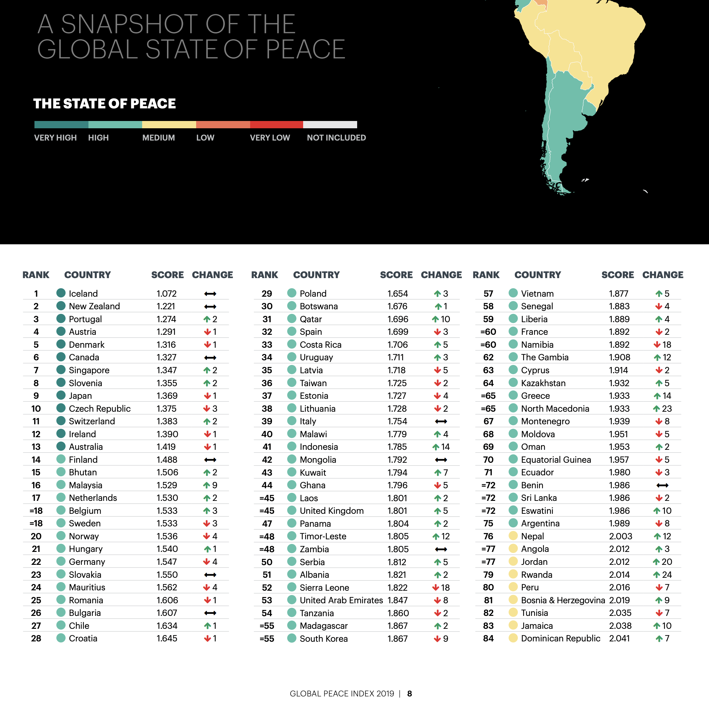

```{r setup, include=FALSE}
library(xfun)
pkg_attach2("tabulizer", "tidyverse", "rvest", "httr", "roperators", "quanteda")
knitr::opts_chunk$set(fig.align = 'center')
```

## 📝 Lesson Preview

- Scraping tables in PDFs

- Text as data

---

class: inverse, center, middle
background-color: #FFC400

# Scraping tables in PDFs

---

class: inverse, center, middle
background-color: #FB3579

## "Please send the data in a PDF" -- no one ever

---

# Table in a PDF

```{r peace-table, echo=FALSE, out.height="300px", out.width="400px", fig.align='center'}

```

PDF at: <http://visionofhumanity.org/app/uploads/2019/07/GPI-2019web.pdf>

Example modified from [Ketan Deshpande](https://medium.com/@ketanrd.009/how-to-extract-pdf-tables-in-r-e994c0fe4e28)

---

# parse PDF in R

Use the [tabulizer](https://github.com/ropensci/tabulizer) package to parse PDFs in R.

⚠️ This requires [rJava](https://cran.r-project.org/web/packages/rJava/index.html), which can be a real pain to install. See [tabulizer README](https://github.com/ropensci/tabulizer/README.md).

---

# Download PDF and extract table

```{r download-pdf, cache=TRUE, warning=FALSE, message=FALSE}
library(tabulizer)

url <- "http://visionofhumanity.org/app/uploads/2019/07/GPI-2019web.pdf"

all_tables <- extract_tables(file = url,
                             pages = 10, # tenth page of the PDF
                             output = "data.frame") 
```

By default, `extract_tables` guesses where the tables are on the page. Use `guess = FALSE` and `areas` argument to specify the areas of the page to extract the table from.

Use `locate_areas(file = url)` to find the areas.

---

# Clean up

```{r}
all_tables_df <- all_tables[[1]]
head(all_tables_df)[, 1:4]
```

Clean up in the lesson practice.

---

# Note: you can also extract text data from PDFs

<br>
<br>
<br>


```R
tabularize::extract_text
```

---

class: inverse, center, middle
background-color: #FFC400

# 📑 Text as data

---

# 📑 Text as data

So far we have assumed that we want to get data into tidy data format, probably for a standard statistical analysis (e.g. linear regression). 

But, we may want to conduct an analysis of the text itself, e.g. [Grimmer and Stewart (2013)](https://www.cambridge.org/core/journals/political-analysis/article/text-as-data-the-promise-and-pitfalls-of-automatic-content-analysis-methods-for-political-texts/F7AAC8B2909441603FEB25C156448F20), using **natural language processing** (NPL) methods. 

Key tools include the [quanteda](https://github.com/quanteda/quanteda) and [tm](https://cran.r-project.org/web/packages/tm/tm.pdf) (text mining) packages. 

---

# Example

Let's scrape COVID-19 press releases from the British Government.

Navigate to <https://www.gov.uk/search/news-and-communications>.

```{r uk-gove-website, echo=FALSE, out.height="400px", out.width="400px"}
knitr::include_graphics("img/uk-gov-announcements.png")
```

---

# Checkout URL structure

Imagine we want to study the Prime Minister's communications regarding COVID-19. 

Understand the URL structure:

```{r boris-news, echo=FALSE, out.height="200px", out.width="200px"}

```

<https://www.gov.uk/search/news-and-communications?level_one_taxon=5b7b9532-a775-4bd2-a3aa-6ce380184b6c&people%5B%5D=boris-johnson&order=updated-newest>

---

# Checkout URL structure for announcements


```{r boris-lists, echo=FALSE}
knitr::include_graphics("img/list-item.png")
```

Links to each announcement are stored in the `href` of anchor tags (`<a>`).

---

# Download the search page

```{r download-announce}
library(rvest)

url <- "https://www.gov.uk/search/news-and-communications?level_one_taxon=5b7b9532-a775-4bd2-a3aa-6ce380184b6c&people%5B%5D=boris-johnson&order=updated-newest"

announce_page <- read_html(url)

announce_page
```

---

# Extract the partial URLS with xpath

**xpath** (XML Path Language) allows you to query nodes in an html document.

```{r xpath-copy, echo=FALSE}
knitr::include_graphics("img/xpath-copy.gif")
```

---

# Extract the partial URLs with xpath

```{r}
announce_page_href <- html_nodes(announce_page,
                        xpath = '//*[@id="js-results"]/div/ol/li[1]/a') %>%
                        html_attr('href') # we want the href element
announce_page_href
```

<br>
<br>

This only extracted the first href because we explicitly referenced the first list item (`li[1]`)
---

# 🔥 Wild cards

Use the `*` wild card to match all of the list items. 

```{r}
announce_page_href <- html_nodes(announce_page,
                        xpath = '//*[@id="js-results"]/div/ol/li[*]/a') %>%
                        html_attr('href') # we want the href element

announce_page_href
```

---

# Multiple pages

There were 29 search results, but we only have:

```{r}
length(announce_page_href)
```

We are missing the additional pages.

Notice URL `page` reference: <https://www.gov.uk/search/news-and-communications?level_one_taxon=5b7b9532-a775-4bd2-a3aa-6ce380184b6c&order=updated-newest&page=2&people%5B%5D=boris-johnson>

---

# While loops to download multiple pages

```{r}
library(roperators) # use infix operator %+=%

all_href <- character() # initialise all results object
tmp_href <- 1 # initalise temp object
i <- 0 # initalise counter
while (length(tmp_href) > 0 ) {
  i %+=% 1
  url <- paste0("https://www.gov.uk/search/news-and-communications?",
                "level_one_taxon=5b7b9532-a775-4bd2-a3aa-6ce380184b6c&",
                "order=updated-newest&page=", 
                as.character(i), 
                "&people%5B%5D=boris-johnson")

  tmp_href <- read_html(url) %>%
              html_nodes(xpath = '//*[@id="js-results"]/div/ol/li[*]/a') %>%
                         html_attr('href')
  
  all_href <- c(all_href, tmp_href)
}
```

---

# While loops to download multiple pages

```{r}
length(all_href)

all_href
```
---

# Get text from one each page

```{r}
url_one <- paste0("https://www.gov.uk", all_href[1])

url_one
```

---

# Get text from one each page

```{r one-announce-text, echo=FALSE}
knitr::include_graphics("img/one-announce-xpath.gif")
```

---

# Get text from one each page

```{r, cache=TRUE}
one_announcement <- read_html(url_one) %>%
          html_nodes(xpath = '//*[@id="content"]/div[3]/div[1]/div[1]/div') %>%
          html_text()

one_announcement
```

---

# Get text from all pages

```{r}
all_texts <- data.frame()
for (i in seq(all_href)) {
  url_one <- paste0("https://www.gov.uk", all_href[i])
  message(url_one)
  
  text <- read_html(url_one) %>%
      html_nodes(xpath = '//*[@id="content"]/div[3]/div[1]/div[1]/div') %>%
      html_text()
  tmp_df <- data.frame(url = all_href[i], text = text)
  all_texts <- bind_rows(all_texts, tmp_df)
}

nrow(all_texts)
```

---

# Simple analysis

Convert to a corpus object

```{r}
library(quanteda)
announce_corpus <- corpus(all_texts)

summary(announce_corpus)
```

---

# A problem

None of the documents should have only one sentence.

🐛 We need to debug.

```{r}
knitr::include_graphics("img/govspeach.png")
```

---

# xpath [contains](https://developer.mozilla.org/en-US/docs/Web/XPath/Functions/contains) function

```{r}
all_texts <- data.frame()
for (i in seq(all_href)) {
  url_one <- paste0("https://www.gov.uk", all_href[i])
  # message(url_one)
  full_html <- read_html(url_one)
  
  text <-  full_html %>% 
    html_nodes(xpath = 
      paste0('//*[@id="content"]/div[3]/div[1]',
             '/div[1]/div[contains(@data-module, "govspeak")]')) %>% 
    html_text()
  
  tmp_df <- data.frame(url = all_href[i], text = text)
  all_texts <- bind_rows(all_texts, tmp_df)
}

announce_corpus <- corpus(all_texts)

summary(announce_corpus)
```

---

# Create a document-term matrix

```{r}
announce_dtm <- dfm(announce_corpus, 
                    remove = stopwords("english"), 
                    stem = TRUE, remove_punct = TRUE) 
announce_dtm
```

---

```{r}
textplot_wordcloud(announce_dtm, min_count = 10)
```

---

class: inverse, center, middle
background-color: #FF8C03

# 🥅 Practice

Scrape and clean up table from <http://visionofhumanity.org/app/uploads/2019/07/GPI-2019web.pdf>

---

class: inverse, center, middle
background-color: #FF8C03

# 🥅 Extended Practice

With a partner, find an online data source. 

What research question might you answer with this data set?

Scrape and clean it for analysis.