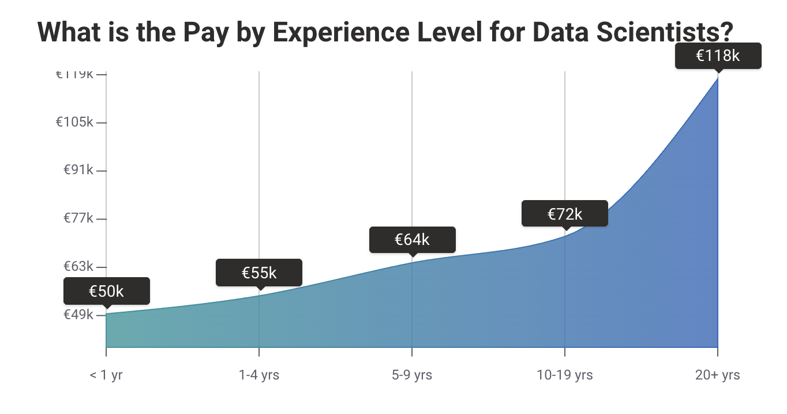
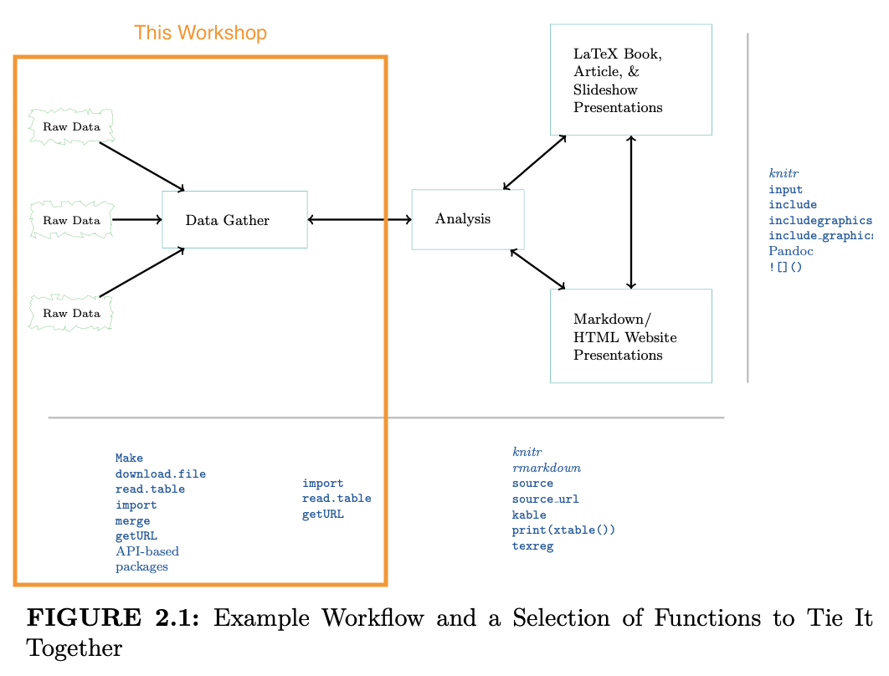

```{r setup, include=FALSE}
library(tidyverse)
theme_set(theme_minimal())
```

# 📝 Lesson Preview

- Why automated data collection, retrieval, and management?

- Why reproducible research?

- Reproducible research workflow

- Personal data privacy and GDPR

---

class: inverse, center, middle

# In your research . . .

---

# 🤔 In your research:

- do you plan to **repeat** the task?

- do you want others to be able to **replicate** your data collection process?

- do you use **online** data sources?

- does the data task have **non-trivial** scope and complexity?


.small[modified from Munzert (2015, xvi)]

---

class: inverse, centre, middle

# . . . ☝️ then automated data retreval and management is for you.

---

class: inverse, centre, middle

# ⍰ What is automated data retrieval and management?

---

class: inverse, centre, middle
background-color: #FFC400
color: #24292F

# Automated data retrieval

> process of **programmatically** extracting data (from structured and unstructured sources) for further data processing, analysis, and storage.

.small[see also [Wikipedia Data Extraction](https://en.wikipedia.org/wiki/Data_extraction)]

---

class: inverse, centre, middle
background-color: #FFC400
color: #24292F

# Automated data management

> Creation, storage, and modification of structured data (including metadata) for programmatic access .

---

class: inverse, centre, middle
background-color: #FFC400
color: #24292F

# Programmatic

> a task done through computer program **code**, not manual.

---

class: inverse, centre, middle
background-color: #FFC400
color: #24292F

# Ideally our programs are **extensible**

> designed to be used not just with data we have seen, but also new data.

---

# 🎓 Academic

- Skills needed to do **original quantitative research** for your **research**.

- State-of-the-art tools needed for **future high-level academic research**.

    + Take advantage of new data sources

    + Avoid effort duplication

    + Make your research reproducible

---

# 🏛 Government 

- Public data is increasingly **accessible**.

    + e.g. [World Bank Development Indicators](http://data.worldbank.org/data-catalog/world-development-indicators),
    [GovData Germany](https://www.govdata.de/neues), [Berlin Open Data](https://daten.berlin.de/), [data.gov.uk](http://data.gov.uk/),
    [New York City](https://nycopendata.socrata.com/),
    [data.gov](https://www.data.gov/open-gov/)

- Governments rely on data analysis for evidence based decision-making.

    + Tools of open data analysis enable better use of data **within** and
    **between** government actors.

    + Governments can take advantage of analyses done by **third parties**.

---

# 🏕 NGOs

NGO's are becoming increasingly data-oriented and need people with **skills** to
**handle and analyse** this data.

Ex. Former Hertie Master's students co-founded
[CorrelAid](http://correlaid.org/) to assist NGOs with data analysis.

---

# 🏭 Industry 

Automated data collection and retrieval **scales**.

We don't just want to solve a customer problem once, we want to solve it many times with the **marginal cost decreasing** each additional time we solve the problem.

```{r return-to-scale, echo=FALSE, fig.height = 2.5, dpi=300}
x <- seq(1, 10, 0.01)
returns_to_scale <- tibble(x = x, y = x^-2)

ggplot(returns_to_scale, aes(x, y)) +
  geom_line(color = "pink", size = 1) +
  xlab("Quantity produced") + ylab("Cost of production\n") +
  theme(
        axis.text.x=element_blank(),
        axis.ticks.x=element_blank(),
        axis.text.y=element_blank(),
        axis.ticks.y=element_blank()
        )
```

---

# 🏭 Industry 

<br>
<br>
<br>

> "It's not interesting if it doesn't scale." -- Jim Freeman

---

# 🏭 Industry 

So, data science being able to automate data retrieval and management are highly valued. E.g. on [PayScale](https://www.payscale.com/research/DE/Job=Data_Scientist/Salary):

```{r pay-by-experience, echo=FALSE}

```

---

class: inverse, centre, middle

# ⍰ Why reproducible research?

---

class: inverse, centre, middle
background-color: #FFC400

# Automated data retrieval and management is a part of reproducible research.

---

class: inverse, centre, middle
background-color: #FF8C03

# ⍰ What is reproducible research?

---

class: inverse, centre, middle
background-color: #FFC400

#  Really reproducible research

> the data and code used to make a finding are **available** and they are **sufficient** for an independent researcher to **recreate the finding** (Peng 2011, 1226)

Make available the research, **not just the advertising** for the findings (e.g. papers, book).

---

# Reproducibility vs. Replication

**Reproducibility**: an independent study makes the same findings using the
**same data** and **code** as the original researchers.

**Replicability**: an independent study makes the same conclusions as the original
using **other** data, code, and even methods,
i.e. independent verification.

---

# Reproducibility vs. Replication

> ''A study can be reproducible and still be wrong'' [Peng 2014](http://simplystatistics.org/2014/06/06/the-real-reason-reproducible-research-is-important/).

E.g. a finding that is statistically significant in one study may remain statistically
significant when reproduced using the original data/code, but **replication studies
are unable to find a similar result**.

The original finding could just have been
[noise](http://andrewgelman.com/2014/09/03/disagree-alan-turing-daniel-kahneman-regarding-strength-statistical-evidence/).

---

# Why reproducibility?

- **Replication** is the ''**ultimate standard**'' for judging scientific claims (Peng 2011).

- **Reproducibility**

    + **Enhances replication** (other researchers can understand how an analysis
    was actually done)

    + Is a **minimum standard** for judging scientific claims when replication is
    not possible.

---

# Why reproducibility?

Reproducibility helps **avoid effort duplication**:

- Others **don't waste time**:

    + Gathering data that has already been gathered.

    + Discovering procedures that have already been discovered.

---

# Why reproducibility?

- Reproducibility also makes it possible to **find and correct errors**.

- Recent examples:
    - Translation errors in the
    [World Values Survey](http://www.washingtonpost.com/blogs/monkey-cage/wp/2014/09/02/world-values-lost-in-translation/).

    - Data errors in research on
    [intestinal worm treatment and school attendance](http://www.columbia.edu/~mh2245/w/worms.html).

    - [L'Affaire LaCour](http://www.vox.com/2015/5/20/8630535/same-sex-marriage-study):
    data *fabrication* discovered.

- Data errors can cause spurious findings that ultimately **waste researchers time**,
because they try to explain 'wrong' findings.

---

# Why reproducibility?

- **Higher research impact**

    + Reproducible research is likely to be more **useful for other researchers**.
    They can use your data and learn from your code and methods.

    + More use → more impact (e.g. citations)

- **Better work habits**

    + Thinking about reproducibility from the beginning makes your files
    **better organised** and your work is **better documented**.

    + This allows you to **build on your own work** more effectively.

---

# Reproducible research workflow

.center[
```{r rep-flow, echo=FALSE, out.width="70%"}

```
]

.small[from Gandrud (2020, 25)]
---

# Practical tips for reproducible research

- ✏️ Document Everything!

- 📄 Everything is a (text) file.

- 🤓 All files should be human readable.

- ⋈ Explicitly tie your files together.

- 🗂 Have a plan to organise, store, and make your files available.

---

class: inverse, center, middle

# Personal data privacy and GDPR

---

class: inverse, center, middle
background-color: #000000

# 🏛 Ethical data retrieval and management

> Privacy and data protection are fundamental rights, which need to be protected. ([EUI 2019](https://www.eui.eu/Documents/ServicesAdmin/DeanOfStudies/ResearchEthics/Guide-Data-Protection-Research.pdf))

---

# Always. . .

Consider the needs for privacy and protecting persons' data.

⚠️ It is especially important for automated data retrieval and management to **build in** privacy and data protection. 

⚠️ Automated data retrieval and management scale. If done poorly they can **scale privacy infringements**. 

---

# Personal data 

> In legal terms, ‘personal data’ means: any information relating to identified or identifiable natural persons referred to as 'data subjects. 'Identifiable persons' can be identified:
- directly, or
- indirectly, in particular by reference to an identification number or to one or more factors specific to their physical, psychological, genetic, mental, economic, cultural or social identity.

.small[EUI (2019, 5)]

---

# Really hard to anonymize

You might think you can simply replace peoples' names with a random number, but . . .

> I conducted an example re-identification study by showing how newspaper stories about hospital visits in Washington State leads to identifying the matching health record 43% of the time ([Sweeney 2015](https://techscience.org/a/2015092903/))

Sweeney's insights led to new areas of data management like [differential privacy](https://www.johndcook.com/blog/2018/11/06/what-is-differential-privacy/). 

---

# Data privacy

> can mean different things in different contexts and cultures. It is therefore important
to detail the purpose of the research according to the different understandings of privacy. For
example, in ‘covert research’ researchers should take into account the meanings of public and
private in the contexts they are studying. Covert observation should only proceed if researchers
can demonstrate clear benefits of the research, when no other research approach seems possible
and when it is reasonably certain that no one will be harmed or suffer as a result of the
observation. EUI (2019, 5)

---

# Data protection

> aims at guaranteeing the individual’s right to privacy. It refers to the **technical
and legal framework** designed to **ensure that personal data are safe** from unforeseen, unintended
or malevolent use. Data protection therefore includes e.g. measures concerning collection, access
to data, communication and conservation of data. In addition, a data protection strategy can also
include measures to assure the accuracy of the data. EUI (2019, 5)

---

# 🇪🇺 GDPR

The EU is a leader in data protection with the General Data Protection Regulation (GDPR, 2016).

---

# 🇪🇺 GDPR penalties

> a fine up to **€20 million or up to 4% of the annual worldwide turnover** of the preceding financial year in case of an enterprise, whichever is greater, if there has been an infringement of the following provisions: (Article 83, Paragraph 5 & 6[31])
- the basic principles for processing, including conditions for consent, pursuant to Articles 5, 6, 7, and 9
the data subjects' rights pursuant to Articles 12 to 222
- the transfers of personal data to a recipient in a third country or an international organisation pursuant to Articles 44 to 49
- any obligations pursuant to member state law adopted under Chapter IX
- noncompliance with an order or a temporary or definitive limitation on processing or the suspension of data flows by the supervisory authority pursuant to Article 58(2) or failure to provide access in violation of Article 58(1)

---

# (some) Good practices

**👍 Do**

- Follow your institution's data protection policies.

- Clearly **document** all of the data you have, your justification for having it, how you maintain and delete it.

- If you handle personal data, **test** that all of your data pipelines don't "leak" the data before you include personal data in it.

- Regularly **review** what data you have and your reason for  having it.

**⚠️ Don't**

- ⚠️ **Never store** personally identifiable data in non-secure locations

- ⚠️ **Never transport** personally identifiable data in non-secure ways (e.g. email)

- ⚠️ **Never store** credentials in non-secure locations

---

# 👀 Course preview: from structured to unstructured data

```{dot struct-to-unstruct, echo=FALSE, cache=TRUE, fig.width=10, fig.retina=2, fig.align='center'}
digraph stricttpimstruct {
    graph [layout = dot, rankdir = LR, overlap = true, fontsize = 30];
    edge [arrowsize = 0.5];
    node [shape = plaintext];

    d1   [label = "Tidy data"];
    d2   [label = "Tabular Data"];
    d3   [label = "HTML Tabular Data"];
    d4   [label = "Nested Data"];
    d5   [label = "Text Data"];

    d1 -> d2;
    d2 -> d3;
    d3 -> d4;
    d4 -> d5
}
```

---

class: inverse, center, middle
background-color: #FB3579

## We are only scratching the surface of what is possible (and needed). Aim: you know where to start.

---

class: inverse, center, middle
background-color: #FF8C03

# 🥅 With a partner

**Identify** ~three online data sets (in any format). What **research questions** could you explore with these data sets?

---

class: inverse, center, middle
background-color: #FF8C03

# 🥅 With a partner

What are the **data privacy and protection** considerations you should make with the ~3 data sets you identified?