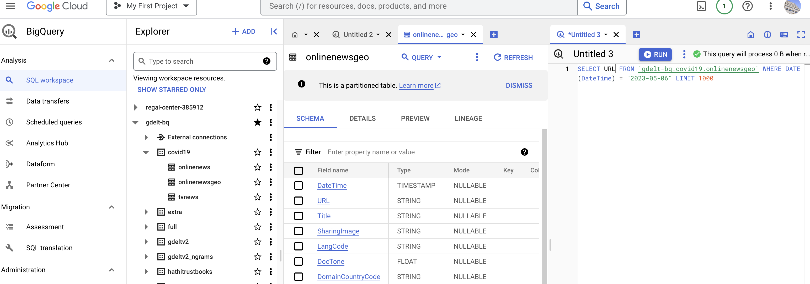

```{r setup, include=FALSE}
library(xfun)
pkg_attach2("tidyverse", "devtools", "repmis", "countrycode", "WDI", 
            "quantmod", "lubridate", "bigrquery", "dbplyr")
```

# 📝 Lesson Preview

- Retrieving and cleaning (tabular) public data

- APIs

- Cleaning grouped data

- Introduction to SQL and quierying relational databases

---

# Accessing data

Significant amounts of data are open for researchers and the public generally.

However, the level of **accessibility varies**:

- use restrictions

- format

- documentation

- version control

- data privacy restrictions

---

# So . . .

<br>
<br>
<br>

We are only going to begin **scratching the surface** of the data access
**obstacles** you are likely to encounter.

---

class: inverse, center, middle

# Retrieving and cleaning (tabular) public data

---

# Remember to programmatically tie your research to your data

Do as much **data gathering** and **cleaning** as possible programmatically:

- Fully document for reproducible research.

- Can find (inevitable) mistakes.

- Easy to update when the data is updated.

- Can apply methods to other data sets.

---

# "Easy" automatic data gathering

1. Plain-text data (e.g. CSV) stored at secure (https) URL, not embedded in
a larger HTML marked-up website.

2. Data stored in a database with a well structured API (Application Programming
    Interface), that has a corresponding R package.

---

# Non-Secure URL Plain-text data

Use `read.table()` or `read.csv()` (just a wrapper for `read.csv()` with `sep = ','`).

Include the URL rather than the file path.

```{r eval=FALSE}
read.table('http://SOMEDATA.csv')
```

---

# Loading compressed plain-text data

You can download and load data files stored in compressed formats (e.g. `.zip`).

1. Download the compressed file into a **temporary file**.

2. Uncompress the file and pass it to `read.table()`, `import()`, etc.

---

# Loading compressed plain-text data

Load data from @Pemstein2010 in a file called *uds_summary.csv*.

Note: this example no longer works because the website was taken down.

```{r, cache=TRUE, warning=FALSE, eval=FALSE}
# For simplicity, store the URL in an object called 'URL'.

URL <- "https://bit.ly/3z4Lay2"

# Create a temporary file called 'temp' to put the zip file into.
temp <- tempfile()

# Download the compressed file into the temporary file.
download.file(URL, temp)

# Decompress the file and convert it into a data frame
uds <- read.csv(gzfile(temp, "uds_summary.csv"))

# Delete the temporary file.
unlink(temp)
```

```{r include=FALSE}
uds <- read.csv(file = "data/uds_summary.csv")
```

---

# Secure (https) URL Plain-text data

Use `import()` from the *rio* package.

Data on GitHub is stored at secure URLs. Select the **RAW** URL:

```{r, message=FALSE}
URL <- paste0('https://raw.githubusercontent.com/christophergandrud/',
        'LegislativeViolence/master/Data/LegViolenceDescriptives.csv')
leg_violence <- readr::read_csv(URL)
head(leg_violence)
```

---

# Versioning and reproducible research

Data maintainers (unfortunately) often change data sets with little or no documentation.

`source_data` allows you to notice these changes by assigning each file a unique
[SHA1 Hash](http://en.wikipedia.org/wiki/SHA-1).

Each download can be checked against the Hash:

```{r, cache=TRUE}
leg_violence <- repmis::source_data(URL,
                sha1 = '01cff579b689cea9ef9c98e433ce3122745cc5cb')
```

🏊 Dive deeper: [source code](https://github.com/christophergandrud/repmis/blob/3989ad8f5d6270ea1c939d8e53ad6c3c14afe4f1/R/utils.R#L39-L51) for hash check.

---

# Excel Files

The `source_XlsxData()` function in repmis does the same hash check as `source_data()`, but for Excel files. It builds on `read.xlsx()` for loading locally stored Excel files. 

Can also use `read_excel()` from [readxl](https://readxl.tidyverse.org/).

Note: Excel data often needs **a lot of cleaning** before it is useful
for statistical/graphical analyses.

---

# Caching

`source_data()` allows you to **cache** data with `cache = TRUE`
([source code](https://github.com/christophergandrud/repmis/blob/3989ad8f5d6270ea1c939d8e53ad6c3c14afe4f1/R/source_data.R#L84-L113)).

Caching stores data so that future requests for the data can be done faster.

Creates a locally stored version of the data set which is useful for 
reproducibility.

The cache and the source can become out of sync, hence the need to be able to compare their hashes.

There are other approaches to achieve similar goals, like [makefiles](https://www.gnu.org/software/make/manual/html_node/Introduction.html).

---

# Data APIs

API = Application Programming Interface, a documented way for programs to talk
to each other.

Data API = a documented way to access data from one program stored with another.

---

# R and Data APIs

R can interact with most data APIs using the [httr](https://github.com/hadley/httr)
package.

Even easier: users have written API-specific packages to interact with 
particular data APIs.

---

# World Bank Development Indications with WDI

Access the [World Bank's Development Indicators](http://data.worldbank.org/indicator)
with the WDI package.

Alternative Energy Use example:

```{r, cache=TRUE, message=FALSE}
# Load WDI package
library(WDI)

# Per country alternative energy use as % of total energy use
alt_energy <- WDI(indicator = 'EG.USE.COMM.CL.ZS')
```

Note: The indicator ID is at the end of the indicator's URL on the World Bank site.

---

# Financial Data with quantmod

The [quantmod](http://www.quantmod.com/) package allows you to access financial
data from a variety of sources (e.g. [Yahoo Finance](http://finance.yahoo.com/),
[Google Finance](https://www.google.com/finance),
[US Federal Reserve's FRED database](http://research.stlouisfed.org/fred2/)).

```{r, message=FALSE, cache=TRUE}
library(quantmod)

# Download Yen/USD exchange rate
YenDollar <- getSymbols(Symbols = 'DEXJPUS', src = 'FRED')

head(YenDollar)
```

See also [tidyquant](https://business-science.github.io/tidyquant/).

---

# Other API-R packages

There are many more R packages that interact with web data APIs.

For a good beginner list see:
<http://cran.r-project.org/web/views/WebTechnologies.html>

---

# Working with non-table data

| Format                                      | R packages                                                              |
| ------------------------------------------- | ----------------------------------------------------------------------- |
| Excel, Stata, SPSS, SAS                     | rio, readxl                                                                     |
| [JSON](http://en.wikipedia.org/wiki/JSON)   | [jsonlite](https://cran.r-project.org/web/packages/jsonlite/index.html) |
| Databases, e.g. a Google BigQuery data base | [dbplyr](https://dbplyr.tidyverse.org/)                                 |

---

class: inverse, center, middle

# Data Cleaning

---

# 🙇 Remember: Tidy data semantics + structure

<br>

1. Each variable forms a column.

2. Each observation forms a row.

3. Each type of observational unit forms a table.

---

# 🙇 Remember: Tidy data

| Person       | treatment | result |
| ------------ | --------- | ------ |
| John Smith   | a         |        |
| Jane Doe     | a         | 16     |
| Mary Johnson | a         | 3      |
| John Smith   | b         | 2      |
| Jane Doe     | b         | 11     |
| Mary Johnson | b         | 1      |

```{r include=FALSE}
# Create messy (wide) data
messy <- data.frame(
  person = c("John Smith", "Jane Doe", "Mary Johnson"),
  a = c(NA, 16, 3),
  b = c(2, 11, 1)
)

messy
```

---

# 🙇 Remember: Messy to Tidy data

First identify what your observations and variables are.

Then use R tools to convert your data into this format.

**tidyr** and is particularly useful.

---

# 🙇 Remember: Messy to tidy data

Using `pivot_longer()`

```{r pivotlonger}
tidied <- tidyr::pivot_longer(data = messy, 
                     cols = c("a", "b"),     # Columns to pivot
                     names_to = "treatment",
                     values_to = "result")
tidied
```

---

# 🙇 Remember: Tidy to messy data

Sometimes it is useful to reverse this operation with `pivot_wider`.

```{r}
messy_again <- tidyr::pivot_wider(data = tidied, 
                                 names_from = "treatment",
                                 values_from = result)

messy_again
```

---

# 🙇 Remember: Other issues cleaning data

Always **look at** and **poke your data**.

For example, see if:

- Missing values are designated with `NA`

- Variable classes are what you expect them to be.

- Distributions are what you expect them to be.

[dlookr](https://cran.r-project.org/web/packages/dlookr/vignettes/diagonosis.html)   a data quality checker package.

---

# Join (merge) tidy data frames

Once you have tidy data frames, you can merge them for analysis.

In general: **each observation** must have a **unique key identifier** to merge 
them on.

These identifiers **must match exactly across the data frames**.

---

# 🔑 Key-Value pairs

Key-value pairs are a fundamental data representation.

Data frames don't have explicit key-value pairs: e.g. 

$$
\langle \mathrm{Christopher},\: \mathrm{Lecturer}\rangle
$$

`Christopher` is the key and the value is `Lecturer`. 

🤓 Fun fact: this is also called a `2-tuple`. Other languages like Python and Julia handle these with data structures called "dictionaries".

---

# Data frames!

Data frames don't have explicit key-value pairings

- Nice for flexibility

- Bad for data manipulation speed and consistency  

---

# Merging data

```{r}
tail(alt_energy, n = 3)
tail(leg_violence, n = 3)
```

---

# Create unique ID: country codes

Unique identifier will be
[iso 2 letter country code](http://en.wikipedia.org/wiki/ISO_3166-1_alpha-2)
and **year**.

Use the [countrycode](https://github.com/vincentarelbundock/countrycode)
package to turn *leg_violence* data's
country names to `iso2c`.

```{r warning=FALSE}
library(countrycode)

# Assign iso2c codes base on correlates of war codes
leg_violence$iso2c <- countrycode(leg_violence$country, 
                                  origin = 'country.name',
                                  destination = 'iso2c', 
                                  warn = TRUE)
```

**NOTE**: Always check the data to make sure the correct codes have been applied!

---

# Creating IDs: Time 

Time units may be important components of observation IDs.

Use the [lubridate](http://cran.r-project.org/web/packages/lubridate/vignettes/lubridate.html)
package to standardise dates.

---

# Creating IDs: Time

```{r, message=FALSE}
library(lubridate)

# Create time data
times <- c('Sep. 17 1980', 'March 23 2000', 'Nov. 3 2003')
mdy(times)
```

Note: Times should always go from **longest to shortest** unit (e.g. YEAR-MONTH-DAY). Makes dates **sortable**.

---

# Join data

```{r}
# Keep only desired variables
leg_violence <- leg_violence[, c('iso2c', 'year', 'udems_mean')]
names(leg_violence)
```

```{r}
combined <- full_join(x = alt_energy, 
                      y = leg_violence,
                      by = c('iso2c', 'year'))
head(combined, n = 3)
```

---

# (Many) of the joins


| Name         | Description                                               |
| ------------ | --------------------------------------------------------- |
| `full_join`  | Returns all rows and columns from both data sets          |
| `inner_join` | Returns all rows where there is a match in both data sets |
| `left_join`  | Returns all rows from x                                   |
| `right_join` | Returns all rows from y                                   |

Joins are a crucial part of Structure Query Language (**SQL**) work that is common in commercial data science for working with data bases

Always **check your data** after a merge to see if you did what you wanted to do!

---

# Clean up

You many want to do some post merge cleaning. For example assign new variable
names:

```{r, eval=FALSE}
names(combined) <- c('iso2c', 'year', 'country',
                     'alt_energy_use',  'uds_median')
```

or

```{r}
combined <- dplyr::rename(combined, new_year = year)
```

---

# Reorder variables

```{r}
combined <- dplyr::relocate(combined, country)

head(combined)
```

---

# More data transformations with dplyr

Set up for examples

```{r message=FALSE}
# Create fake grouped data
library(randomNames)
library(dplyr)
library(tidyr)

people <- randomNames(n = 1000)
people <- sort(rep(people, 4))
year <- rep(2010:2013, 1000)
trend_income <- c(30000, 31000, 32000, 33000)

income <-  replicate(trend_income + rnorm(4, sd = 20000),
                     n = 1000) %>%
            data.frame() %>%
            gather(obs, value, X1:X1000)

income$value[income$value < 0] <- 0
data <- data.frame(people, year, income = income$value)
```

---

# dplyr

```{r}
head(data)
```

---

# Filter dplyr

Select rows

```{r}
higher_income <- filter(data, income > 60000)

head(higher_income)
```

---

# Select dplyr

Select columns

```{r}
people_income <- select(data, people, income)

# OR
people_income <- select(data, -year)

head(people_income)
```

---

# dplyr with grouped data

Tell dplyr what the groups are in the data with `group_by`.

```{r}
group_data <- group_by(data, people)

head(group_data)[1:5, ]
```

Note: the following functions work on **non-grouped data** as well.

---

# dplyr with grouped data

Now that we have declared the data as grouped, we can do operations on each group.

For example, we can extract the highest and lowest income years for each person:

```{r}
min_max_income <- summarize(group_data,
                            min_income = min(income),
                            max_income = max(income))

head(min_max_income)[1:3, ]
```

---

# dplyr with grouped data

We can sort the data using `arrange`.

```{r}
# Sort highest income for each person in ascending order
ascending <- arrange(min_max_income, max_income)

head(ascending)[1:3, ]
```

---

# dplyr with grouped data

Add `desc` to sort in descending order

```{r}
descending <- arrange(min_max_income, desc(max_income))

head(descending)[1:3, ]
```

---

# dplyr with grouped data

`summarize` creates a new data frame with the summarised data.

We can use `mutate` to add new columns to the original data frame.

```{r}
data <- mutate(group_data,
                min_income = min(income),
                max_income = max(income))

head(data)[1:3, ]
```

---

# Introduction to SQL and accessing databases from R

SQL (Structured Query Language) is a programming language used to manage and manipulate **relational databases**.

Relational databases aren't super common in academics, but **industry runs on them**.

---

# What is a "relational database"?

> A relational database is a type of database that stores data in tables with rows and columns. Each table represents a **specific entity** or concept, such as customers, orders, or products. The **relationships** between the tables are defined by common fields, or **keys**, which allow data to be linked and combined from multiple tables. 

🗯
If you understand **tidy data principles** and merging data, working with SQL databases should be conceptually easy. **dbplyr** even lets you use dplyr syntax to query databases/generate SQL from R code (`translate_sql`).

The devil is in the **connections** (to the tables) and **syntax**.

---

# High level example 

- Illustrates basic steps:

  - Connect to database (project)
  
  - Run query and return output to R

- From [bigrquery](https://bigrquery.r-dbi.org/#dplyr) docs

- Assumes you have already set up BigQuery.

```r
library(dplyr)

# Connect to natality table for a prespecified connection
natality <- tbl(con, "natality")

# Query table
natality %>%
  select(year, month, day, weight_pounds) %>% 
  head(10) %>%
  collect()
```

---

# SQL Syntax walk through

Assume we have two databases with the data as above for `alt_engergy` and `leg_violence`. 
The following SQL query joins the "alt_energy" and "leg_violence" databases for the specific countries and years:

```sql
SELECT *
FROM alt_energy
JOIN leg_violence
ON alt_energy.iso2c = leg_violence.iso2c AND alt_energy.year = leg_violence.year
WHERE (alt_energy.iso2c = 'DE' OR alt_energy.iso2c = 'KR') AND alt_energy.year >= 2001
LIMIT 100;
```

- `*` selects all columns from both data sets. Specify specific columns with the (unquoted) names, separated by `,` commas.

- `FROM` and `JOIN` specifies the base table and the one to join with it.

- `WHERE` clause filters the results to include only specific rows.
  
- `LIMIT 100` limits the data returned to the first 100 rows (for convenience)

---

# Note!

<br>
<br>
<br>

Note, to run a SQL example from R we would need to connect to set up database connections, which we don't have time for in this course and are service specific.

Instead we aim to give you the core principles needed so that you can get started faster with a relational database you do encounter "in the wild".

---

# But you can play with SQL from BigQuery's web interface

[Google BigQuery](https://cloud.google.com/bigquery) is one popular relational database hosting platform. 

You can interact with it using **dbplyr** or [bigrquery](https://bigrquery.r-dbi.org/)

To follow along, you will need to sign up for a [Google Cloud](https://cloud.google.com/bigquery) account. You need a credit card, but "free" with ~$300 credit for 90 days.

- Once you are signed up, Click "Analyze and manage data (BigQuery)" to access BigQuery"

---

# BigQuery web interface

```{r big-query-interface, echo=FALSE}

```

---

class: inverse, center, middle
background-color: #FF8C03

# 🥅 Practice

Download two data sets (that conceivable could be merged) using the API-based packages discussed today. Either in the same or a linked R script  **clean** and **merge** the data.

And/Or set up GoogleBig Query and practice querying from the included example data sets. 
